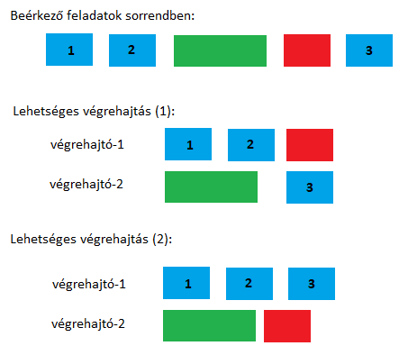

# 5. feladat: feladat ütemezésre szolgáló adatstruktúra

## Ajánlott olvasnivaló

Producer-consumer ("termelő-fogyasztó") probléma: https://en.wikipedia.org/wiki/Producer%E2%80%93consumer_problem

Technical writing (angol nyelven): https://ocw.mit.edu/courses/mechanical-engineering/2-000-how-and-why-machines-work-spring-2002/tools/technicalwriting_fixed.pdf

## Feladat

A rendszerbe előre nem ismert feladatokat adnak be párhuzamosan termelők. A feladatokat pár fogyasztó dolgozza fel. A feladatok beérkezési ideje ill. végrehajtási ideje nem ismert. Az ütemező feladata a feladatok fogadása, és a fogyasztók számára mindig egy új feladat kiadása.

### Az ütemezésnek meg kell felelnie az alábbi szabályoknak

1. Egy feladatot csak egy végrehajtónak szabad kiadni.
1. Ha a feladat végrehajtása valamilyen okból meghiúsul (pl. a végrehajtó szál elesik), a feladatot vissza kell tenni a végrehajtási sorba.
1. A feladatok "színezettek": minden feladathoz tartozik egy szín (praktikusan egy szám). Az egész rendszerben egy adott színű feladatból egy időben csak egy lehet végrehajtás alatt.
1. Egy adott színhez tartozó feladatokat a beadás sorrendjében kell végrehajtani.

Az ütemező valójában nem egy algoritmus, hanem egy adatstruktúra. Az ütemezőnek legalább két művelete van: feladat beadása (ezt hívja a termelő), valamint a következő feladat elkérése (ezt hívja a fogyasztó). A rendszerben fix számú (de előre nem rögzített) végrehajtó szál van (vagyis ez a szám induláskor egy bemeneti paraméter, utána a rendszer futása alatt nem változik, de előre nem ismert a szám).

Az ütemezőnek szálbiztosnak kell lennie, mivel egyszerre történik a feladat beadása és végrehajtandó feladatok elkérése.

### Javasolt megközelítés

Az ütemező tekintetében két javasolt megoldás a (3)-as szabály betartása érdekében:

* Egy feladat kezdete esetén "letiltásra" kerül az adott szín, és a feladat befejezésekor vissza kell szólni az ütemezőnek, hogy újból kiadható ilyen színű feladat.
* A színek hozzá vannak rendelve a végrehajtó szálakhoz, így egy adott színt mindig ugyanaz a végrehajtó szál kaphat csak meg. Ekkor viszont azt kell megoldani, hogy új szín érkezése esetén is (tehát olyan feladat, ami egy új, még nem látott színnel rendelkezik) megtörténjen a feldolgozó szálhoz rendelés.

Használható más megközelítés is, de akkor egy dokumentációt is kérek a működésről.

### Készíts egy C# nyelvű programot, amely

* Konzol alkalmazás
* Elindít pár végrehajtó szálat (darabszám az alkalmazás paramétere)
* Elindít egy szálat, ami feladatokat termel véletlen időközönként, a feladatok színe is véletlen (egyenletes eloszlású)
* A feladat maga legyen egy hosszú for ciklus, nem kell értelmes feladatot csináljon, de használja ki a CPU-t
  * Pl. legyen a Fibonacci sorozat n-edik elemének kiszámolása, ahol az n egy véletlen nagy szám
  * Sleep semmiképpen nem jó
  * Legyünk benne biztosak, hogy a fordító nem optimalizálja ki az algoritmust azért, mert észreveszi, hogy az eredményt nem használjuk
    * Pl. a kiszámolt értéket hasonlítsuk össze egy negatív számmal, és írjunk ki a konzolra egy szöveget egyezés esetén
    * Mivel a Fibonacci soha nem lesz negatív, ezért a feltétel soha nem teljesül, de ezt a fordító nem tudja
* Az ütemező pedig az adatstruktúra, aki a termelő szál és fogyasztó szálak között van

### Elvárt eredmény

* Működőképes program
* Teszt kód (pl. unit tesztek formájában), ami ellenőrzi a helyes viselkedés
* Átbocsátóképesség vizsgálat: hány feladatot képes a rendszer adott időn belül "megoldani", változó paraméterek függvényében
  * Paraméter a fogyasztó szálak száma és a feladat színek száma
* "Technical report" a megoldásról és a kiértékelésről
  * Docx, pfd vagy markdown formátumban

### Dokumentáció ("technical report")

Szoftverfejlesztés során gyakran szükséges egy rendszer alapján, architektúráját, egy-egy kulcsfontosságú komponenst dokumentálni. A dokumentáció olyan minőségű kell legyen, hogy azt évekkel később is megértse bárki. A párhuzamos algoritmusok gyakran komplexek, a kód önmaga nem feltétlenül elég dokumentáció. Így a feladat része egy 2-3 oldalas "technical report" elkészítése, amely a megvalósítást és az eredményeket magyarázza. A dokumentáció lényege a helyes szerkezet és technikai nyelvezet használata (akár magyar, akár angol nyelven).